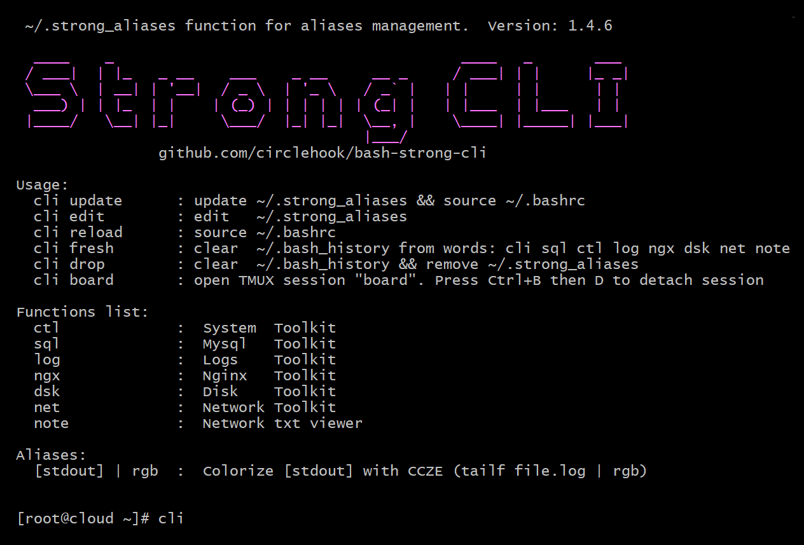

# About 
The file **strong_aliases** contains bash functions and aliases. That are include in the ~/.bashrc, to quickly perform daily tasks in the console. SSH root access required.




# Manual
Main function **cli** show a list of available functions. Each function displays help when launched.
| Function    |  Description         | Screenshot   | 
| ----------- |  ------------------- | ----------   | 
|  ctl        |  System  Toolkit     |				|
|  sql        |  Mysql   Toolkit     |				|
|  log        |  Logs    Toolkit     |				|
|  ngx        |  Nginx   Toolkit     |				|
|  dsk        |  Disk    Toolkit     |				|
|  net        |  Network Toolkit     |				|
|  note       |  Network txt viewer  |				|


# Install

#### Software requirements (optional)
```
apt install -y ccze tmux tar gunzip unzip rsync smartmontools
```

#### One command launch
```
curl https://raw.githubusercontent.com/circlehook/bash-strong-cli/refs/heads/main/install.sh | bash && source ~/.bashrc && cli
``` 
#### Manual install 
```
wget -q -O - https://raw.githubusercontent.com/circlehook/bash-strong-cli/refs/heads/main/strong_aliases > ~/.strong_aliases
grep -q "strong_aliases" ~/.bashrc || echo "[ -f ~/.strong_aliases ] && . ~/.strong_aliases" >> ~/.bashrc
source ~/.bashrc
```
#### Usage
```
cli
```

# Pretty launch on your domain

#### Create a file cli.sh in the root of your site
```
#!/bin/bash

wget -q -O - https://raw.githubusercontent.com/circlehook/bash-strong-cli/refs/heads/main/strong_aliases > ~/.strong_aliases
grep -q "strong_aliases" ~/.bashrc || echo "[ -f ~/.strong_aliases ] && . ~/.strong_aliases" >> ~/.bashrc
```
#### Install and run
```
curl https://your.domain/cli.sh | bash                # need re-login
curl https://your.domain/cli.sh | bash && exec bash   # without re-login, with restart bash
cli 
```
#### One command launch
```
curl https://your.domain/cli.sh | bash && source ~/.bashrc && cli
```
# Uninstall
To uninstall aliases, run:
```
cli drop
```
#### Manual uninstall
Remove row from ~/.bashrc, delete file ~/.strong_aliases and re-login to console
```
nano /root/.bashrc
rm /root/.strong_aliases
source ~/.bashrc        
```